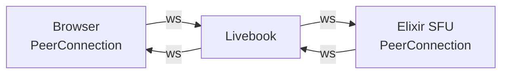

# Echo your face detection with the SFU ExWebRTC

```elixir
Mix.install([
  {:kino, "~> 0.13.1"},
  {:ex_webrtc, "~> 0.3.0"},
])
```

## What are we doing?

We are illustrating the SFU server `ExWebRTC` by broadcasting our webcam via `WebRTC`. 

This is a **low** latency protocole running on UDP.

We are **not** using the "standard" peer-to-peer WebRTC connection but we are connecting to an SFU server written in Elixir.

We transform the feed directly in the browser. It is mandatory to start with the "hello world" of computer vision, namely face detection. We use the library [`face-api`](https://www.npmjs.com/package/@vladmandic/face-api?activeTab=readme). You will notice that the results are not so good.

The transformed stream will be sent to the SFU server.

We broadcast it back in another `<video`> element.

## How to use this?


The repo contains the model data used by `face-api`.

You can run the Livebook:


[](https://livebook.dev/run?url=https%3A%2F%2Fgithub.com%2Fdwyl%2FWebRTC-SFU-demo%2Fblob%2Fmain%2Flib%2Fecho.livemd)


## The WebRTC flow without the face detection addition

The webcam is captured and displayed in a first `<video>` element.

The browser and the Elixir SFU will establish a WebRTC PeerConnection via a signaling channel: the Livebook WebSocket.

They will exchange SDP and ICE candidates.

Once connected, the Elixir SFU will receive the streams from the `<video 1>` via a UDP connection. In this Echo configuration, it will send back the streams to the connected peer via UDP and display them in the other `<video 2>` element.

<!-- livebook:{"break_markdown":true} -->

### Information flow

- The signaling process (instantiate the PeerConnection):



- The active connection:


<!-- livebook:{"break_markdown":true} -->

### Server-side WebRTC module

```elixir
defmodule RtcServer do
  use GenServer

  alias ExWebRTC.{ICECandidate, PeerConnection, SessionDescription, MediaStreamTrack, RTPCodecParameters}
  alias ExWebRTC.RTP.VP8.Depayloader

  require Logger

  defp ice_servers(), do: [%{urls: "stun:stun.l.google.com:19302"}]
  defp video_codecs, do: [
    %RTPCodecParameters{
      payload_type: 96,
      mime_type: "video/VP8",
      clock_rate: 90_000
    }
  ]

  defp setup_transceivers(pc) do
    media_stream_id = MediaStreamTrack.generate_stream_id()
    video_track = MediaStreamTrack.new(:video, [media_stream_id])
    {:ok, _sender} = PeerConnection.add_track(pc, video_track)
    %{serv_video_track: video_track}
  end

  # public ----------------
  def start_link(args), do: GenServer.start_link(__MODULE__, args, name: __MODULE__)
  def connect, do: GenServer.call(__MODULE__, :connect)

  def receive_signaling_msg({msg, sender}) do
    GenServer.cast(__MODULE__, {:receive_signaling_msg, msg, sender})
  end

  def peek_state, do: GenServer.call(__MODULE__, :peek_state)

  # callbacks-------------------------
  @impl true
  def init(_args) do
    Logger.info("ExRtc PeerConnection started")


    {:ok, %{
      sender: nil,
      pc: nil,
      client_video_track: nil,
      video_depayloader: Depayloader.new(),
      i: 1,
      t: System.monotonic_time(:microsecond)
    }}
  end

  # Livebook calls
  @impl true
  def handle_call(:peek_state, _, state) do
    {:reply, state, state}
  end

  def handle_call(:connect, _, state) do
    {:ok, pc_pid} =
      PeerConnection.start_link(ice_servers: ice_servers(), video_codecs: video_codecs())

    state = %{state | pc: pc_pid} |> Map.merge(setup_transceivers(pc_pid))
    {:reply, :connected, state}
  end

  # messages received from the client
  @impl true
  def handle_cast({:receive_signaling_msg, %{"type"=> "offer"} = msg, sender},state) do
    with desc <-
           SessionDescription.from_json(msg),
         :ok <-
           PeerConnection.set_remote_description(state.pc, desc),
         {:ok, answer} <-
           PeerConnection.create_answer(state.pc),
         :ok <-
           PeerConnection.set_local_description(state.pc, answer),
         :ok <-
           gather_candidates(state.pc) do

      #  the 'answer' is formatted into a struct, which can't be read by the JS client
      answer = %{"type" =>  "answer", "sdp" => answer.sdp}
      send(sender, {:signaling, answer})
      Logger.warning("--> Server sends Answer to remote")
      {:noreply, %{state | sender: sender}}
    else
      error ->
        Logger.error("Server: Error creating answer: #{inspect(error)}")
        {:stop, :shutdown, state}
    end
  end

  def handle_cast({:receive_signaling_msg, %{"type"=> "ice"} = msg, _sender}, state) do
    candidate = ICECandidate.from_json(msg["candidate"])
    :ok = PeerConnection.add_ice_candidate(state.pc, candidate)
    Logger.debug("--> Server processes remote ICE")
    {:noreply, state}
  end

  def handle_cast({:receive_signaling_msg, {msg, _}}, state) do
    Logger.warning("Server: unexpected msg: #{inspect(msg)}")
    {:stop, :shutdown, state}
  end

  @impl true
  def handle_info({:ex_webrtc, _pc, {:track, %{kind: :video} = client_video_track}}, state) do
    {:noreply, %{state | client_video_track: client_video_track}}
  end

  # internal messages --------
  def handle_info({:ex_webrtc, _pc, {:ice_candidate, candidate}}, state) do
    candidate = ICECandidate.to_json(candidate)
    send(state.sender, {:signaling, %{"type"=> "ice", "candidate" => candidate}})
    Logger.debug("--> Server sends ICE to remote")
    {:noreply, state}
  end

  def handle_info(
        {:ex_webrtc, pc, {:rtp, client_track_id, _rid, packet}},
        %{client_video_track: %{id: client_track_id, kind: :video}} = state
      ) do
    PeerConnection.send_rtp(pc, state.serv_video_track.id, packet)

    {:noreply, state}
  end

  def handle_info({:ex_webrtc, pc, {:connection_state_change, :connected}}, state) do
    PeerConnection.get_transceivers(pc)
    |> Enum.find(&(&1.kind == :video))
    |> then(fn %{receiver: receiver} ->
      Logger.warning("PeerConnection successfully connected, using #{inspect(receiver.codec.mime_type)}")
      end)

    {:noreply, state}
  end

  def handle_info({:ex_webrtc, _pc, _msg}, state) do
    {:noreply, state}
  end

  defp gather_candidates(pc) do
    receive do
      {:ex_webrtc, ^pc, {:ice_gathering_state_change, :complete}} -> :ok
    after
      1000 -> {:error, :timeout}
    end
  end
end
```

We will start the RTC GenServer.

```elixir
Supervisor.start_link([RtcServer], strategy: :one_for_one)
```

We instantiate a new PeerConnection:

```elixir
:connected = RtcServer.connect()
```

This will instantiate a `ExWebRTC.PeerConnection` server-side.
It is waiting for a peer to connect and receive its offer. It will respond with an "answer", digest the peer's Ice candidates, and send to the peer its own ICE candidates.

```elixir
RtcServer.peek_state()
```

### Client-side WebRTC module

On connection, a new `PeerConnection` is created. Since the server is already connected, the client will send an "offer" via the signaling channel. The client expects an "answer" back. It will also send "Ice" candidates via the signaling channel, and expects to receive Ice candidates from the server.

Once the connection is set, the client will receive RTP packets and digest them into a `<video>` element.

We use a `Kino.JS.Live` since we obviously need a signaling channel (the Live WebSocket).

> Kino expects us to code a "main.js" module that exports and `init` function
> Github serves files from the repo but with a modified URL ("https://raw.githubusercontent.com...")
> Kino does not load files from an URL, but from a location.


```elixir
defmodule VideoLive do
  # GenServer to communicate between browser and Livebook server

  use Kino.JS
  use Kino.JS.Live

  require Logger

  @html """
    <div id="elt">
      <figure>
        <video id="source" width="500" height="500" muted autoplay playsinline></video>
        <figcaption>Local webcam</figcaption>
      </figure>
      <br/>
      <figure>
        <video id="echo" width="500" height="500" autoplay muted playsinline></video>
        <figcaption>Echo webcam</figcaption>
      </figure>
    </div>
  """

  asset "main.js" do
  """
  export async function init(ctx, html) {
    ctx.importCSS("main.css");
    ctx.root.innerHTML = html;
    await ctx.importJS("https://cdn.jsdelivr.net/npm/@vladmandic/face-api/dist/face-api.js");

    const iceConf = {iceServers: [{ urls: "stun:stun.l.google.com:19302" }]};

    async function run() {
      console.log("Starting.....");
      let stream = await window.navigator.mediaDevices.getUserMedia({
        video: { width: 300, height: 300 },
        audio: false,
      });

      // display the webcam in a <video> tag
      const videoIn = document.getElementById("source");
      videoIn.srcObject = stream;
      await videoIn.play();

      // -------------------face-api ------------------
      await faceapi.nets.tinyFaceDetector.loadFromUri(
        "https://raw.githubusercontent.com/dwyl/WebRTC-SFU-demo/main/lib/assets/model"
      );

    async function processFrames(video) {
      const displaySize = {width: video.width, height: video.height};

      let canvas = faceapi.createCanvasFromMedia(video);
      faceapi.matchDimensions(canvas, displaySize);

      async function drawAtVideoRate() {
        const context = canvas.getContext("2d");
        context.drawImage(video, 0, 0, displaySize.width, displaySize.height);
        const detections = await faceapi.detectAllFaces(
          video,
          new faceapi.TinyFaceDetectorOptions()
        );
        const resizedDetections = faceapi.resizeResults(detections,displaySize);
        faceapi.draw.drawDetections(canvas, resizedDetections);
        video.requestVideoFrameCallback(drawAtVideoRate);
      }

        video.requestVideoFrameCallback(drawAtVideoRate);
        return canvas.captureStream(30); // 30 FPS
      }

      const transformedStream = await processFrames(videoIn);

      //----------------------- WEBRTC-----------------------------
      const pc = new RTCPeerConnection(iceConf);
  
      // capture local MediaStream (from the webcam)
      const tracks = transformedStream.getTracks();
      tracks.forEach((track) => pc.addTrack(track, stream));
  
      // send offer to any peer connected on the signaling channel
      pc.onicecandidate = ({ candidate }) => {
        if (candidate === null) {
          return;
        }
        ctx.pushEvent("ice", { candidate: candidate.toJSON(), type: "ice" });
      };

      // send offer to any peer connected on the signaling channel
      pc.onnegotiationneeded = async () => {
        const offer = await pc.createOffer();
        await pc.setLocalDescription(offer);
        console.log("--> Offer created and sent");
        ctx.pushEvent("offer", { sdp: offer });
      };

      // received from the remote peer (Elixir SFU server here) via UDP
      pc.ontrack = ({ streams }) => {
        console.log("--> Received remote track");
        const echo = document.querySelector("#echo");
        echo.srcObject = streams[0];
      };

      // received from the remote peer via signaling channel (Elixir server)
      ctx.handleEvent("ice", async ({ candidate }) => {
        await pc.addIceCandidate(candidate);
      });
  
      ctx.handleEvent("answer", async (msg) => {
        console.log("--> handled Answer");
        await pc.setRemoteDescription(msg);
      });

      // internal WebRTC listener, for information or other action...
      pc.onconnectionstatechange = () => {
        console.log("~~> Connection state: ", pc.connectionState);
      };
    }

    run();
  }
  """
  end

  def run() do
    Kino.JS.Live.new(__MODULE__, @html)
  end

  @impl true
  def init(html, ctx) do
    {:ok, assign(ctx, html: html)}
  end

  @impl true
  def handle_connect(ctx) do
    {:ok, ctx.assigns.html, ctx}
  end

  # received from the browser via the signaling WebSocket, call server
  @impl true
  def handle_event("offer",%{"sdp" => sdp}, ctx) do
    RtcServer.receive_signaling_msg({sdp, self()})
    {:noreply, ctx}
  end

  def handle_event("ice",%{"candidate" => candidate}, ctx) do
    RtcServer.receive_signaling_msg({%{"type" => "ice", "candidate" => candidate}, self()})
    {:noreply, ctx}
  end

  # received from the server, send to the browser via signaling WebSocket
  @impl true
  def handle_info({:signaling, %{"type" => "answer"} = msg}, ctx) do
    broadcast_event(ctx, "answer", msg)
    {:noreply, ctx}
  end

  def handle_info({:signaling, %{"type" => "ice"} = msg}, ctx) do
    if msg["candidate"], do: broadcast_event(ctx, "ice",msg)
    {:noreply, ctx}
  end
end
```

## Run it!

```elixir
VideoLive.run()
```

The PeerConnection server-side is now populated:

```elixir
RtcServer.peek_state()
```

## Javascript of the WebRTC and the face detection drawing

It relies on the method [`requestVideoFrameCallback`](https://developer.mozilla.org/en-US/docs/Web/API/HTMLVideoElement/requestVideoFrameCallback).

You can transform each frame of a video stream, _at the rate of the video_, namely 30fps.

We use this transformed stream and add it to the PeerConnection track. Et voilà.
